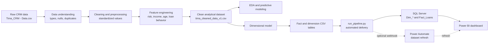
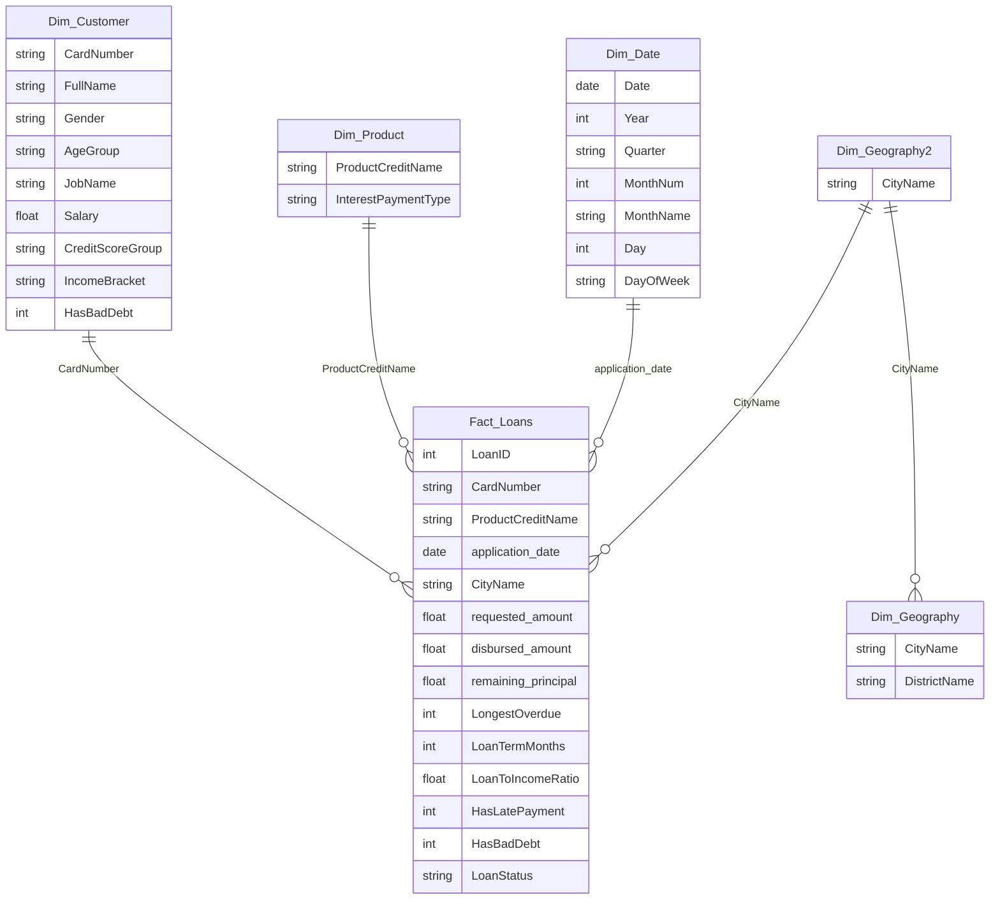

<div align="center">

# TIMA Bank Credit Risk Analytics Project

### *An end-to-end credit-risk analytics pipeline from CRM data to SQL Server and Power BI*

<h3>🏦 💳 📈 🧹 🧠 🗂️ 🚀</h3>

<p>
  
  
  
</p>

<p>
  
  
  
</p>

<p>
  
  
  
</p>

<br />

*From raw CRM lending records to cleaned analytical data, risk insights, predictive models, SQL Server tables, and an interactive Power BI dashboard.*

<p>
  <b>🏦 Credit Portfolio</b> &nbsp;•&nbsp;
  <b>🧹 Data Cleaning</b> &nbsp;•&nbsp;
  <b>📊 Exploratory Analytics</b> &nbsp;•&nbsp;
  <b>🧠 Predictive Modeling</b> &nbsp;•&nbsp;
  <b>🗂️ Star Schema</b> &nbsp;•&nbsp;
  <b>📈 Power BI</b>
</p>

</div>

---

## Project Overview

An end-to-end data analytics and predictive modeling project for TIMA loan data. The project turns raw CRM lending records into a cleaned analytical dataset, explores customer and loan behavior, builds a dimensional data model, compares machine learning approaches for credit risk classification, and publishes the BI-ready outputs into SQL Server for Power BI reporting.

The work is designed to answer practical lending questions:

- 🧑‍💼 Who are TIMA's core borrowers?
- 💰 Which products drive loan volume and disbursement value?
- ⚠️ Which customer, product, income, geography, and credit-history signals are associated with late payment or bad debt?
- 🤖 Can historical loan information support an early-warning credit risk model?
- 🗂️ How can the cleaned data be reshaped into fact and dimension tables for BI reporting?
- 🔁 How can the refresh flow be automated from notebooks to SQL Server and Power BI?

## Table of Contents

- [Project Overview](#project-overview)
- [Project Highlights](#project-highlights)
- [Repository Structure](#repository-structure)
- [Data Pipeline](#data-pipeline)
- [Dataset Overview](#dataset-overview)
- [Notebook Guide](#notebook-guide)
- [Analytical Themes](#analytical-themes)
- [Modeling Approach](#modeling-approach)
- [Key Findings](#key-findings)
- [Dimensional Model](#dimensional-model)
- [Automated Pipeline, SQL Server, and Power BI](#automated-pipeline-sql-server-and-power-bi)
- [Power BI Dashboard](#power-bi-dashboard)
- [How to Run](#how-to-run)
- [Dependencies](#dependencies)
- [Dataset Note](#dataset-note)
- [Limitations](#limitations)
- [Future Improvements](#future-improvements)

## Project Highlights

| Area | What this project does |
| --- | --- |
| Data understanding | Profiles raw CRM loan data, data types, missing values, duplicates, and inconsistent formats. |
| Data cleaning | Converts dates, monetary values, gender flags, salary, bad debt flags, and late payment flags into analytical formats. |
| Feature engineering | Creates age groups, loan term, processing days, loan-to-income ratio, credit score group, income bracket, disbursement gap, repayment ratio, and standardized loan status. |
| Exploratory analysis | Studies loan amount, requested amount, product mix, loan status, demographics, geography, income, occupation, residence type, and risk variables. |
| Risk analysis | Examines how LoanStatus changes across products, cities, age groups, gender, salary brackets, occupations, residence types, credit score groups, bad debt history, and late payment history. |
| Predictive modeling | Compares Logistic Regression, Random Forest, and XGBoost models for multi-class risk labels and binary Risk/Safety classification. |
| BI-ready data model | Exports fact and dimension tables for reporting, dashboards, and further analytics. |
| Automated pipeline | Uses `scripts/run_pipeline.py` to execute the notebook pipeline, rebuild output tables, and load them into SQL Server. |
| SQL Server delivery | Writes the final `Dim_*` and `Fact_Loans` tables to the configured SQL Server schema. |
| Power BI dashboard | Includes a Power BI report file connected to the dimensional model for portfolio, risk, product, and geography reporting. |

## Repository Structure

```text
TIMA_Bank_Project/
├── data/
│   ├── Tima_CRM - Data.csv
│   ├── tima_cleaned_data_v1.csv
│   └── Dim_Fact Table/
│       ├── Dim_Customer.csv
│       ├── Dim_Date.csv
│       ├── Dim_Geography.csv
│       ├── Dim_Geography2.csv
│       ├── Dim_Product.csv
│       └── Fact_Loans.csv
├── notebook/
│   ├── data_understanding.ipynb
│   ├── data_cleaning_preprocessing.ipynb
│   ├── data_analysis_and_predictive_modeling.ipynb
│   └── create_dim_fact_table.ipynb
├── scripts/
│   └── run_pipeline.py
├── Dashboard/
│   └── TIMA_Data analysis dashboard.pbix
├── .gitignore
├── environment.yml
├── requirements.txt
└── README.md
```

## Data Pipeline



## Dataset Overview

The project works with TIMA CRM loan records. The cleaned analytical file contains approximately 2.3K loan records and 55 columns after preprocessing and feature engineering.

### Main data files

| File | Description |
| --- | --- |
| `data/Tima_CRM - Data.csv` | Original CRM export with raw customer, loan, product, location, income, credit, and repayment fields. |
| `data/tima_cleaned_data_v1.csv` | Cleaned and enriched analytical dataset used for EDA and modeling. |
| `data/Dim_Fact Table/Fact_Loans.csv` | Loan-level fact table for BI reporting. |
| `data/Dim_Fact Table/Dim_Customer.csv` | Customer dimension with demographic, job, income, and risk attributes. |
| `data/Dim_Fact Table/Dim_Product.csv` | Product dimension with credit product and interest payment type. |
| `data/Dim_Fact Table/Dim_Date.csv` | Date dimension generated from application dates. |
| `data/Dim_Fact Table/Dim_Geography.csv` | Geography dimension at city and district level. |
| `data/Dim_Fact Table/Dim_Geography2.csv` | Simplified geography dimension at city level. |

### Automation and reporting files

| File | Description |
| --- | --- |
| `scripts/run_pipeline.py` | Runs the notebook pipeline with Papermill, reloads dimensional CSV outputs into SQL Server, and optionally triggers a Power Automate refresh webhook. |
| `Dashboard/TIMA_Data analysis dashboard.pbix` | Power BI dashboard file built on top of the project outputs. |

### Important original fields

| Field | Meaning |
| --- | --- |
| `LoanID` | Unique loan identifier. |
| `CardNumber` | Customer identity key used for customer-level grouping. |
| `application_date` | Date when the customer applied for the loan. |
| `FromDate`, `ToDate` | Loan period start and end dates. |
| `Số tiền đăng ký vay ban đầu` | Initial requested loan amount. |
| `Tiền giải ngân` | Disbursed loan amount. |
| `Tiền gốc còn lại` | Remaining principal balance. |
| `Trạng thái` | Original loan status from the CRM system. |
| `TS_CREDIT_SCORE_V2` | Internal credit score. |
| `ProductCreditName` | Loan product type. |
| `Salary` | Customer income. |
| `JobName` | Customer occupation. |
| `CityName`, `DistrictName` | Customer geography. |
| `HasBadDebt` | Whether the customer has bad debt history. |
| `HasLatePayment` | Whether the customer has late payment history. |
| `LongestOverdue` | Longest overdue period recorded. |

### Engineered fields

| Field | Description |
| --- | --- |
| `Age` | Customer age calculated from birthday and application date. |
| `AgeGroup` | Age bucket such as `18-25`, `26-35`, `36-45`, and older groups. |
| `LoanTermMonths` | Loan duration in months. |
| `ProcessingDays` | Days between application date and loan start date. |
| `LoanToIncomeRatio` | Requested loan amount divided by monthly salary. |
| `Cần Giải Ngân` | Requested amount minus disbursed amount. |
| `Đã trả/khoản vay đã giải ngân` | Remaining principal divided by disbursed amount. |
| `LowCreditScore` | Binary flag for credit scores below 600. |
| `CreditScoreGroup` | Credit score bucket: Low, Medium, Good, Excellent. |
| `IncomeBracket` | Salary bucket: `<5m`, `5-10m`, `10-15m`, `15-25m`, `>=25m`. |
| `LoanStatus` | Standardized business status: `Hoàn thành`, `Muộn`, `Nợ xấu`, `Đang vay`. |

## Notebook Guide

Run the notebooks in this order for the clearest project flow.

| Order | Notebook | Purpose |
| --- | --- | --- |
| 1 | `notebook/data_understanding.ipynb` | Loads the raw CRM file, checks shape, data types, missing values, duplicate records, and performs first-stage cleaning. |
| 2 | `notebook/data_cleaning_preprocessing.ipynb` | Builds analytical features, creates loan status labels, checks final nulls, and exports the cleaned dataset. |
| 3 | `notebook/data_analysis_and_predictive_modeling.ipynb` | Performs exploratory analysis, risk segmentation, model training, model tuning, AUC evaluation, and feature importance analysis. |
| 4 | `notebook/create_dim_fact_table.ipynb` | Converts the cleaned flat dataset into BI-friendly fact and dimension tables. |

For production-style refreshes, `scripts/run_pipeline.py` automates notebooks 1, 2, and 4, then pushes the final dimensional tables into SQL Server. The modeling notebook remains an analytical notebook and is not part of the automated SQL Server load.

## Analytical Themes

The analysis is organized around four major lenses.

### 1. Loan Core Fields

- Distribution of requested loan amounts and disbursed amounts.
- Difference between requested and approved/disbursed values.
- Outlier behavior in unusually large loan applications.
- Product-level loan count, total disbursement, and average disbursement.
- LoanStatus distribution and non-performing loan ratio.

### 2. Customer Demographics

- Gender distribution.
- Age distribution and age-group concentration.
- City-level borrower concentration.
- Residence type distribution and relationship with repayment behavior.

### 3. Income and Occupation

- Salary distribution and salary outliers.
- Common occupations in the borrower base.
- Loan size differences across income and occupation groups.
- Product preference by income bracket and job type.

### 4. Risk Variables

- Credit score distribution.
- Bad debt history rate.
- Late payment history rate.
- Relationship between risk variables and LoanStatus.
- Interaction effects such as credit score plus bad debt history, age plus income, and product plus income.

## Modeling Approach

The project contains two modeling tracks.

### Track 1: Rule-Based Multi-Class Risk Level

The notebook creates a `Risk_Level` target from `TS_CREDIT_SCORE_V2` and `HasBadDebt`:

| Risk level | Rule |
| --- | --- |
| `Cao (High)` | Conservative fallback for cases that are not Medium or Low, including low credit scores and any bad debt history. |
| `Trung bình (Medium)` | Credit score from 500 to 700 and no bad debt. |
| `Thấp (Low)` | Credit score above 700 and no bad debt. |

**Feature set for Track 1**

These features are selected for the rule-based `Risk_Level` experiment. Since the target is defined from credit score and bad debt logic, the model is expected to learn the rule structure very strongly.

| Feature role | Selected features |
| --- | --- |
| Rule-driving credit variables | `TS_CREDIT_SCORE_V2`, `HasBadDebt` |
| Additional repayment history | `HasLatePayment`, `NumberOfLoans` |
| Financial capacity | `Salary`, `IncomeBracket`, `LoanToIncomeRatio` |
| Loan behavior | `Loan_log`, `LoanTermMonths` |
| Customer profile | `JobName`, `Hình thức cư trú`, `AgeGroup`, `Gender` |
| Product and geography | `ProductCreditName`, `CityName` |

`Loan_log` is created from `Tiền giải ngân` using `log1p` to reduce the impact of very large loan outliers. Categorical fields are one-hot encoded with `pd.get_dummies`, and numerical fields are scaled with `StandardScaler` before training.

Models compared:

- Multinomial Logistic Regression
- Random Forest Classifier
- XGBoost Classifier
- Tuned Logistic Regression with `RandomizedSearchCV`
- Tuned Random Forest with `RandomizedSearchCV`
- Tuned XGBoost with `RandomizedSearchCV`

Important modeling note: this target is rule-based, and the same rule-driving fields are also included as features. Very high scores in this track mainly show that the models can reproduce the label rule. They should not be interpreted as proof of a fully independent credit-risk prediction system.

Selected observed results:

| Model | Test Accuracy | Test F1 Macro | Test AUC |
| --- | ---: | ---: | ---: |
| Logistic Regression | 0.9727 | 0.9569 | 0.9987 OvR macro |
| Random Forest | 0.9287 | 0.9328 | 0.9735 OvR macro |
| XGBoost Baseline | 1.0000 | 1.0000 | 1.0000 OvR macro |
| Logistic Regression - Tuned | 0.9727 | 0.9569 | 0.9987 OvR macro |
| Random Forest - Tuned | 0.9937 | 0.9864 | 1.0000 OvR macro |
| XGBoost - Tuned | 1.0000 | 1.0000 | 1.0000 OvR macro |

Top features in the tuned XGBoost rule-based model include:

- `TS_CREDIT_SCORE_V2`
- `HasBadDebt`
- `NumberOfLoans`
- `Gender`
- `Salary`
- `ProductCreditName`
- `CityName`
- `Loan_log`
- `LoanTermMonths`
- `LoanToIncomeRatio`

### Track 2: LoanStatus-Based Risk/Safety Classification

The second modeling approach uses observed repayment status:

| Group | Definition |
| --- | --- |
| `Risk` | `Late` or `Non-Performing` |
| `Safety` | `Completed` |

Ongoing loans (`Active`) are excluded from this binary target because the final repayment outcome is not yet known.

Observed class distribution:

| Class | Count |
| --- | ---: |
| Safety | 1,586 |
| Risk | 731 |

**Feature set for Track 2**

These features are selected for the observed repayment-behavior model. Unlike Track 1, this target comes from actual `LoanStatus` outcomes after removing ongoing loans.

| Feature role | Selected features |
| --- | --- |
| Credit history signals | `TS_CREDIT_SCORE_V2`, `HasBadDebt`, `HasLatePayment` |
| Borrowing history | `NumberOfLoans` |
| Affordability signals | `Salary`, `IncomeBracket`, `LoanToIncomeRatio` |
| Loan structure | `Loan_log`, `LoanTermMonths` |
| Product risk signals | `ProductCreditName` |
| Customer and location context | `JobName`, `Hình thức cư trú`, `AgeGroup`, `Gender`, `CityName` |

For this track, ongoing loans are removed before modeling, then the remaining loans are stratified into train/test sets so the `Risk` and `Safety` balance is preserved. The same preprocessing pattern is applied: one-hot encoding for categorical variables and `StandardScaler` for numerical variables.

Selected observed results:

| Model | Test Accuracy | Test F1 Macro | Test AUC |
| --- | ---: | ---: | ---: |
| Logistic Regression - Tuned | 0.7823 | 0.7609 | 0.8245 |
| Random Forest - Tuned | 0.7974 | 0.7784 | 0.8366 |
| XGBoost - Tuned | 0.7845 | 0.7622 | 0.8345 |

For the Risk/Safety target, the tuned Random Forest produced the strongest observed AUC. Its most important features include:

- `LoanTermMonths`
- `ProductCreditName_Vay theo sim`
- `Hình thức cư trú_Thuê`
- `Loan_log`
- `LoanToIncomeRatio`
- `TS_CREDIT_SCORE_V2`
- `NumberOfLoans`
- `CityName_Hồ Chí Minh`
- `Salary`
- `CityName_Hà Nội`

## Key Findings

### Loan Size and Product Mix

- TIMA loans are heavily concentrated in the small consumer loan segment.
- Typical loans cluster around 5-10 million VND.
- The requested and disbursed amount distributions are strongly right-skewed.
- A small number of very large loans create a long tail and should be handled carefully in modeling.
- Phone pawning and motorcycle pawning dominate loan volume.
- Some high-value products have low frequency but high average disbursement.

### Loan Status and Repayment Risk

- `Hoàn thành` is the largest LoanStatus group, with 1,586 records.
- `Muộn` is also significant, with 525 records.
- `Nợ xấu` accounts for 206 records, giving an observed NPL ratio of about 8.64%.
- The late-loan group is important because it may represent future bad debt risk.

### Customer Profile

- The borrower base is concentrated in young working-age customers, especially the 26-35 age group.
- Female customers are the majority in the dataset.
- Customers are highly concentrated in Hanoi, with Ho Chi Minh City as the second major market.
- Salary is concentrated around lower-middle income bands, especially 5-10 million VND.

### Risk Segmentation

- Low credit score groups contain a much higher share of bad debt.
- Customers with prior bad debt history have a higher observed NPL rate than those without it.
- SIM-based loan products show elevated risk concentration compared with some collateralized products.
- Rental residence status and several unstable occupation groups show higher late or risky behavior.
- Loan size is driven by a combination of income, job stability, age, product type, and collateral value.

## Dimensional Model

The project exports a simple star-schema-style model for BI tools.



This model supports reporting questions such as:

- Loan volume by month, quarter, city, product, or customer segment.
- Disbursement value by product and geography.
- NPL ratio by product, city, occupation, income bracket, and credit score group.
- Late payment exposure by loan term and loan-to-income ratio.

Geography is provided in two levels:

- `Dim_Geography.csv`: city and district lookup for more detailed geographic analysis.
- `Dim_Geography2.csv`: city-only lookup, which matches the `CityName` field stored in `Fact_Loans.csv`.

## Automated Pipeline, SQL Server, and Power BI

The project now includes `scripts/run_pipeline.py` for a repeatable refresh flow from source data to BI consumption.

### What the pipeline does

1. Executes the core notebook workflow with Papermill:
   - `notebook/data_understanding.ipynb`
   - `notebook/data_cleaning_preprocessing.ipynb`
   - `notebook/create_dim_fact_table.ipynb`
2. Stores executed notebook copies in `runs/` for audit/debugging.
3. Reads the final CSV outputs from `data/Dim_Fact Table/`.
4. Validates key table quality rules:
   - `Fact_Loans.LoanID` must not contain null values.
   - `Dim_Customer.CardNumber` must be unique.
5. Loads all final tables into SQL Server through `sqlalchemy` and `pyodbc`.
6. Optionally calls a Power Automate webhook to refresh the Power BI dataset/report after SQL Server has been updated.

### SQL Server output tables

The pipeline writes these tables to the schema defined by `SQL_SCHEMA`:

| SQL Server table | Source CSV |
| --- | --- |
| `Dim_Customer` | `data/Dim_Fact Table/Dim_Customer.csv` |
| `Dim_Product` | `data/Dim_Fact Table/Dim_Product.csv` |
| `Dim_Date` | `data/Dim_Fact Table/Dim_Date.csv` |
| `Dim_Geography` | `data/Dim_Fact Table/Dim_Geography.csv` |
| `Dim_Geography2` | `data/Dim_Fact Table/Dim_Geography2.csv` |
| `Fact_Loans` | `data/Dim_Fact Table/Fact_Loans.csv` |

During each run, the script first creates `stg_*` tables, then replaces the final tables with the refreshed versions. Because this is a full-refresh load, make sure the target schema is dedicated to this project or that replacing these tables is acceptable.

### Required `.env` settings

Create a local `.env` file in the project root.

```env
SQLSERVER_CONNECTION_STRING=DRIVER={ODBC Driver 18 for SQL Server};SERVER=your_server;DATABASE=name_of_database;UID=your_user;PWD=your_password;TrustServerCertificate=yes/no
SQL_SCHEMA= <Can set default>
PAPERMILL_KERNEL= <Can be set default>
POWER_AUTOMATE_REFRESH_URL=
```

## Power BI Dashboard

The repository includes the Power BI report file:

```text
Dashboard/TIMA_Data analysis dashboard.pbix
```

Use this file in Power BI Desktop to review the dashboard, update data-source settings, refresh visuals, and publish to Power BI Service. The expected reporting layer is the SQL Server dimensional model produced by the pipeline:

- `Dim_Customer`
- `Dim_Product`
- `Dim_Date`
- `Dim_Geography` or `Dim_Geography2`
- `Fact_Loans`

Recommended Power BI refresh flow:

1. Run `python scripts/run_pipeline.py`.
2. Confirm the refreshed tables are available in SQL Server.
3. Open or publish `Dashboard/TIMA_Data analysis dashboard.pbix`.
4. Configure the Power BI data source to the same SQL Server database/schema.
5. Refresh manually in Power BI Desktop or use the optional Power Automate webhook for Power BI Service refresh.

## How to Run

### 1. Clone or open the project

```bash
cd "TIMA_Bank_Project"
```

### 2. Create a Python environment

```bash
python -m venv .venv
source .venv/bin/activate
```

On Windows:

```bash
python -m venv .venv
.venv\Scripts\activate
```

### 3. Install dependencies

Using `pip`:

```bash
pip install -r requirements.txt
```

Or using Conda:

```bash
conda env create -f environment.yml
conda activate tima-bank-credit-risk
```

### 4. Launch Jupyter

```bash
jupyter notebook
```

Then open the notebooks from the `notebook/` directory and run them in the recommended order.

### 5. Run the automated SQL Server and Power BI pipeline

Before running the automated pipeline, make sure:

- SQL Server is reachable from your machine.
- The Microsoft ODBC Driver for SQL Server is installed.
- `.env` contains `SQLSERVER_CONNECTION_STRING`.
- The target database/schema exists.

Run:

```bash
python scripts/run_pipeline.py
```

This command regenerates the cleaned dataset and dimensional outputs, loads them into SQL Server, and optionally triggers Power Automate for Power BI refresh.

### 6. Rebuild outputs manually

To regenerate the cleaned dataset and dimensional tables:

1. Run `notebook/data_understanding.ipynb`.
2. Run `notebook/data_cleaning_preprocessing.ipynb`.
3. Run `notebook/create_dim_fact_table.ipynb`.

To rerun the analysis and models:

1. Make sure `data/tima_cleaned_data_v1.csv` exists.
2. Run `notebook/data_analysis_and_predictive_modeling.ipynb`.

## Dependencies

The notebooks use the Python libraries listed in `requirements.txt` and `environment.yml`:

- `pandas`
- `numpy`
- `matplotlib`
- `seaborn`
- `scikit-learn`
- `scipy`
- `xgboost`
- `jupyter`
- `ipykernel`
- `papermill`
- `python-dotenv`
- `SQLAlchemy`
- `pyodbc`
- `requests`

The notebook metadata shows a Python 3 kernel. Python 3.10+ is recommended. The automated SQL Server load also requires a local Microsoft ODBC Driver for SQL Server that matches the driver name used in `SQLSERVER_CONNECTION_STRING`.

## ⚠️ Dataset Note

> ⚠️ This dataset is used only for learning, analysis, and project demonstration purposes. It is not a production dataset from a real business environment.

Any personal-looking information in the files, such as customer names, card numbers, phone numbers, addresses, company names, income values, and family contact fields, should be understood as sample project data. These details do not represent real individuals and should not be interpreted as actual customer information.

## Limitations

- The dataset is relatively small, with about 2.3K loan records.
- Geographic coverage is highly concentrated, especially in Hanoi, which limits generalization to other markets.
- Some fields have missing or inconsistent values in the raw CRM extract.
- Some very large loan amounts behave as outliers and can strongly influence averages and models.
- The multi-class `Risk_Level` target is rule-based and partially derived from variables used as model inputs.
- The binary Risk/Safety model is more behavior-based, but still needs additional validation before operational use.
- Ongoing loans are excluded from the Risk/Safety target because their final outcome is not yet known.

## Future Improvements

- Pin package versions after final validation for stricter reproducibility.
- Add automated data validation checks for date logic, negative values, impossible ages, and outlier thresholds.
- Build a reusable preprocessing pipeline with `sklearn.pipeline`.
- Add cross-validation summaries and model calibration curves.
- Test models on a later time period to evaluate true out-of-time predictive performance.
- Compare rule-based labels with real repayment outcomes to measure business usefulness.
- Add formal Power BI deployment notes, scheduled refresh settings, and gateway configuration screenshots.
- Add incremental-load logic for SQL Server when the CRM export grows beyond full-refresh size.
- Document feature definitions in a formal data dictionary.

## Project Summary

This project moves from raw lending operations data to business-ready credit analytics. It cleans and enriches TIMA CRM records, identifies borrower and product risk patterns, builds predictive models, exports a BI-ready dimensional structure, loads it into SQL Server, and connects it to Power BI. The result is a practical foundation for credit portfolio monitoring, customer segmentation, risk warning, and dashboard-driven decision making.
